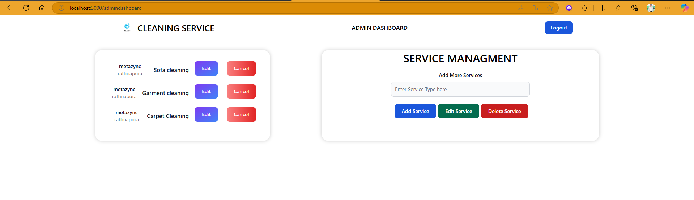

# Metazync-mini-project
**Note : You can use buddhima@gmail.com && 123 for admin username and password to login admin dashboard.

---

# 🧹 Cleaning Service Management Web Application

A mini project for managing cleaning service bookings. This web application provides user and admin functionalities, including booking services, managing bookings, and handling service offerings. Built using the MERN stack (MongoDB, Express.js, React.js, Node.js).

---

## 🚀 Features

- **User Features:**
  - Book cleaning services.
  - View and manage personal bookings.

- **Admin Features:**
  - Add, edit, and delete services.
  - Manage all user bookings.

- **Core Technologies:**
  - **Frontend**: React with Material UI/Tailwind CSS
  - **Backend**: Node.js with Express.js
  - **Database**: MongoDB

---
## Screenshot




---

## 📂 Project Structure

```bash
project-directory/
├── backend/       # Backend server with Node.js and Express.js
├── frontend/      # Frontend React application
└── README.md      # Project documentation
```

---

## 🛠️ Installation and Setup

### Prerequisites

- Node.js installed on your system
- MongoDB server running locally or remotely
- Git for cloning the repository

### 1. Clone the Repository

```bash
git clone https://github.com/your-username/cleaning-service-management.git
cd cleaning-service-management
```

---

### 2. Backend Setup

Navigate to the `backend` folder:

```bash
cd backend
```

#### Install Dependencies:

```bash
npm install
```

#### Configure Environment Variables:

Create a `.env` file in the `backend` folder with the following content:

```
MONGO_URI=<your_mongodb_connection_string>
PORT=5000
```

#### Start the Backend Server:

```bash
nodemon server.js
```

The backend server will run on `http://localhost:5000`.

---

### 3. Frontend Setup

Navigate to the `frontend` folder:

```bash
cd ../frontend
```

#### Install Dependencies:

```bash
npm install
```

#### Start the Frontend Server:

```bash
npm start
```

The frontend application will run on `http://localhost:3000`.

---

## 🧩 How to Run the Project

1. Start the **backend server**:
   ```bash
   cd backend
   nodemon server.js
   ```

2. Start the **frontend server**:
   ```bash
   cd frontend
   npm start
   ```

3. Open your browser and navigate to:
   - Frontend: `http://localhost:3000`
   - Backend (API): `http://localhost:5000`

---

## 📦 API Endpoints (Backend)

### User Endpoints:
- `POST /api/register`: Register a new user
- `POST /api/login`: Login an existing user
- `GET /api/bookings`: Fetch user bookings

### Admin Endpoints:
- `POST /admin/addservice`: Add a new cleaning service
- `GET /admin/getservice`: Fetch all cleaning services
- `UPDATE /admin/updateservice/:id`: update a service
- `DELETE /admin/deleteservice/:id`: Delete a service

---

## 🛠️ Built With

- **Frontend**: React.js, Material UI / Tailwind CSS
- **Backend**: Node.js, Express.js
- **Database**: MongoDB Compass

---

## 🏗️ Future Enhancements

- Add email notifications for booking confirmations.
- Implement advanced service filtering and sorting.

---

## 🤝 Contributing

Contributions are welcome! To contribute:

1. Fork the repository.
2. Create a new branch (`git checkout -b feature/your-feature-name`).
3. Commit your changes (`git commit -m 'Add some feature'`).
4. Push to the branch (`git push origin feature/your-feature-name`).
5. Open a Pull Request.

---

## 📜 License

This project is licensed under the MIT License. See the [LICENSE](LICENSE) file for details.

---

## 📧 Contact

For any queries, feel free to reach out to:

- **Email**: buddhimachathuranga300@gmail.com
- **GitHub**: [Buddhima300](https://github.com/buddhima300?tab=repositories)

--- 

Let me know if you need any additional modifications!
